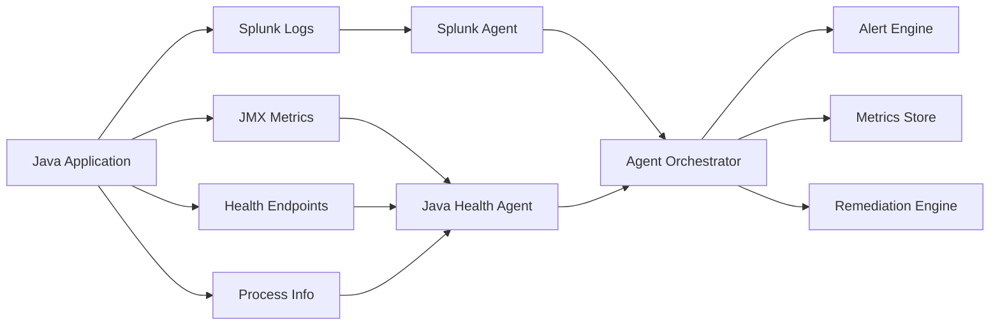

# Crown Jewel Monitor - Architecture Guide

## 🏗️ System Architecture Overview

The Crown Jewel Monitor is built using an **agentic architecture** where autonomous agents work together to provide comprehensive monitoring, detection, and remediation capabilities for Java applications.

## 🎯 Design Principles

### **1. Autonomous Operation**
- Agents operate independently with minimal human intervention
- Self-healing capabilities for common issues
- Adaptive learning from monitoring data and incidents

### **2. Multi-source Intelligence**
- Combines data from Splunk logs, JMX metrics, health endpoints, and system processes
- Cross-correlation of events across different data sources
- Holistic view of application health and performance

### **3. Proactive Detection**
- Predictive analytics to identify issues before they impact users
- Pattern recognition for known problem signatures
- Anomaly detection using statistical and ML techniques

### **4. Scalable & Resilient**
- Horizontally scalable agent architecture
- Fault-tolerant design with graceful degradation
- High availability through redundancy and failover

## 🏛️ Core Components

### **1. Agent Framework (`core/agent_framework.py`)**

The foundation layer providing common functionality for all monitoring agents.

```python
┌─────────────────────────────────────────────────────────┐
│                    BaseAgent                            │
│ ┌─────────────────┐ ┌─────────────────┐ ┌─────────────┐│
│ │   Lifecycle     │ │  Event System   │ │   Metrics   ││
│ │   Management    │ │                 │ │ Collection  ││
│ │                 │ │ • Alerts        │ │             ││
│ │ • Initialize    │ │ • Metrics       │ │ • Emit      ││
│ │ • Execute       │ │ • Actions       │ │ • Store     ││
│ │ • Cleanup       │ │ • Callbacks     │ │ • Analyze   ││
│ └─────────────────┘ └─────────────────┘ └─────────────┘│
└─────────────────────────────────────────────────────────┘
```

**Key Features:**
- **Standardized Lifecycle**: Initialize → Execute → Cleanup pattern
- **Event-driven Architecture**: Callbacks for alerts, metrics, and actions
- **Error Handling**: Comprehensive error recovery and logging
- **State Management**: Persistent state across restarts

### **2. Agent Orchestrator**

Central coordinator managing multiple agents and global system state.

```python
┌─────────────────────────────────────────────────────────┐
│                Agent Orchestrator                       │
├─────────────────────────────────────────────────────────┤
│  Agent Management    │  Event Processing │  Scheduling  │
│                     │                   │              │
│ • Registration      │ • Alert Routing   │ • Continuous │
│ • Lifecycle Control │ • Metric Aggr.    │ • On-demand  │
│ • Health Monitoring │ • Cross-agent     │ • Parallel   │
│ • Resource Mgmt     │   Correlation     │ • Sequential │
├─────────────────────┼───────────────────┼──────────────┤
│           Global State Management                       │
│ • System Health  • Performance Baselines  • Config     │
└─────────────────────────────────────────────────────────┘
```

**Responsibilities:**
- **Agent Coordination**: Manages agent lifecycle and execution
- **Global Event Processing**: Routes and correlates events across agents
- **System Health Assessment**: Provides overall system health status
- **Configuration Management**: Centralized configuration distribution

### **3. Specialized Monitoring Agents**

#### **Splunk Agent (`agents/splunk_agent.py`)**

Intelligent log analysis and pattern detection through Splunk integration.

```python
┌─────────────────────────────────────────────────────────┐
│                   Splunk Agent                          │
├─────────────────────────────────────────────────────────┤
│ Log Pattern       │ Query Execution   │ Anomaly         │
│ Recognition       │                   │ Detection       │
│                  │                   │                 │
│ • Regex Patterns │ • SPL Queries     │ • Statistical   │
│ • Business Rules │ • Scheduled Exec  │ • ML-based      │
│ • Error Detection│ • Result Parsing  │ • Baseline      │
│ • Security Events│ • Cache Mgmt      │   Comparison    │
├─────────────────┼───────────────────┼─────────────────┤
│              Real-time Analysis                         │
│ • Log Streaming  • Event Correlation  • Alert Generation│
└─────────────────────────────────────────────────────────┘
```

**Monitoring Capabilities:**
- **Error Rate Analysis**: Java exceptions, fatal errors, system failures
- **Performance Monitoring**: Response times, throughput, latency
- **Security Event Detection**: Authentication failures, access violations
- **Business Logic Monitoring**: Transaction failures, data validation errors
- **Infrastructure Monitoring**: Database connections, cache performance

#### **Java Health Agent (`agents/java_health_agent.py`)**

Comprehensive JVM and application health monitoring.

```python
┌─────────────────────────────────────────────────────────┐
│                Java Health Agent                        │
├─────────────────────────────────────────────────────────┤
│ JVM Monitoring    │ Health Endpoints  │ Process         │
│                  │                   │ Monitoring      │
│ • Memory Usage   │ • Spring Actuator │                 │
│ • GC Analysis    │ • Custom Health   │ • CPU Usage     │
│ • Thread Dumps   │ • Component Health│ • Memory Usage  │
│ • Heap Analysis  │ • Response Times  │ • Thread Count  │
├─────────────────┼───────────────────┼─────────────────┤
│           Performance Analysis & Prediction             │
│ • Trend Analysis • Capacity Planning • Anomaly Detection│
└─────────────────────────────────────────────────────────┘
```

**Health Monitoring:**
- **JVM Metrics**: Memory pools, garbage collection, thread states
- **Application Health**: Component health, dependency status
- **Performance Metrics**: Response times, error rates, throughput
- **Resource Monitoring**: CPU, memory, network, file descriptors
- **Predictive Analysis**: Memory leak detection, performance trends

## 🔄 Data Flow Architecture

### **1. Data Collection Pipeline**



### **2. Event Processing Flow**

```python
┌─────────────────┐    ┌─────────────────┐    ┌─────────────────┐
│  Data Sources   │ -> │    Agents       │ -> │  Orchestrator   │
│                 │    │                 │    │                 │
│ • Splunk Logs   │    │ • Parse & Anal  │    │ • Correlate     │
│ • JMX Metrics   │    │ • Pattern Match │    │ • Prioritize    │
│ • Health Checks │    │ • Anomaly Detect│    │ • Route Events  │
│ • Process Data  │    │ • Generate Events│    │ • Global State  │
└─────────────────┘    └─────────────────┘    └─────────────────┘
         │                       │                       │
         v                       v                       v
┌─────────────────┐    ┌─────────────────┐    ┌─────────────────┐
│  Raw Data       │    │    Events       │    │   Actions       │
│                 │    │                 │    │                 │
│ • Log Entries   │    │ • Alerts        │    │ • Notifications │
│ • Metric Points │    │ • Metrics       │    │ • Remediation   │
│ • Health Status │    │ • Actions       │    │ • Escalation    │
│ • System Stats  │    │ • Correlations  │    │ • Reporting     │
└─────────────────┘    └─────────────────┘    └─────────────────┘
```

## 🧠 Intelligence Layer

### **1. Pattern Recognition Engine**

**Predefined Patterns:**
- Java Exception Patterns (OutOfMemoryError, NullPointerException)
- Performance Degradation Patterns (Slow queries, timeouts)
- Security Event Patterns (Failed authentication, access violations)
- Business Logic Patterns (Transaction failures, validation errors)

**Learning Patterns:**
- Adaptive pattern recognition from historical data
- False positive reduction through feedback loops
- Custom pattern creation based on environment

### **2. Anomaly Detection System**

**Statistical Methods:**
- Baseline establishment from historical data
- Standard deviation analysis for outlier detection
- Trend analysis for performance regression
- Seasonal pattern recognition

**Machine Learning Approaches:**
- Time series forecasting for predictive alerts
- Clustering for behavior pattern recognition
- Classification for incident categorization
- Ensemble methods for improved accuracy

### **3. Correlation Engine**

**Cross-agent Correlation:**
- Event timing correlation across different agents
- Root cause analysis through dependency mapping
- Impact assessment across system components
- Cascade failure detection and prevention

## 🔧 Configuration Architecture

### **1. Hierarchical Configuration**

```yaml
# Global configuration affects all agents
global:
  log_level: INFO
  monitoring_interval: 60
  max_concurrent_agents: 5

# Agent-specific configurations
agents:
  splunk_monitor:
    type: splunk
    config:
      host: "splunk.company.com"
      # ... agent-specific settings
      
  java_health_monitor:
    type: java_health
    config:
      jmx_host: "localhost"
      # ... agent-specific settings
```

### **2. Dynamic Configuration**

- **Runtime Updates**: Configuration changes without restart
- **Environment-specific**: Different configs for dev/staging/prod
- **Feature Flags**: Enable/disable features dynamically
- **A/B Testing**: Test different monitoring strategies

## 🔐 Security Architecture

### **1. Authentication & Authorization**

```python
┌─────────────────────────────────────────────────────────┐
│                Security Layer                           │
├─────────────────────────────────────────────────────────┤
│ Authentication    │ Authorization     │ Data Protection │
│                  │                   │                 │
│ • API Tokens     │ • Role-based      │ • PII Filtering │
│ • Certificates   │ • Resource-based  │ • Encryption    │
│ • Splunk Auth    │ • Action-based    │ • Audit Logging │
│ • JMX Security   │ • Time-based      │ • Secure Storage│
└─────────────────────────────────────────────────────────┘
```

### **2. Data Security**

- **Encryption in Transit**: TLS for all network communications
- **Encryption at Rest**: Sensitive configuration and metrics data
- **Access Control**: Role-based access to monitoring data and actions
- **Audit Trail**: Complete logging of all access and actions

## 🚀 Performance Architecture

### **1. Scalability Design**

**Horizontal Scaling:**
- Multiple agent instances for high-volume monitoring
- Load balancing across agent instances
- Distributed processing for large-scale deployments
- Auto-scaling based on monitoring load

**Vertical Scaling:**
- Efficient resource utilization through async processing
- Memory optimization through data streaming
- CPU optimization through intelligent sampling
- Storage optimization through data compression

### **2. Performance Optimizations**

**Data Collection:**
- Intelligent sampling to reduce overhead
- Batch processing for efficiency
- Caching frequently accessed data
- Connection pooling for external systems

**Processing:**
- Asynchronous processing for non-blocking operations
- Parallel processing for independent tasks
- Stream processing for real-time analysis
- Background processing for heavy analytics

## 🔄 Deployment Architecture

### **1. Deployment Patterns**

**Single Instance Deployment:**
```
┌─────────────────────────────────────────┐
│           Single Host                   │
│ ┌─────────────────────────────────────┐ │
│ │      Agent Orchestrator             │ │
│ │ ┌─────────────┐ ┌─────────────────┐ │ │
│ │ │Splunk Agent │ │Java Health Agent│ │ │
│ │ └─────────────┘ └─────────────────┘ │ │
│ └─────────────────────────────────────┘ │
└─────────────────────────────────────────┘
```

**Distributed Deployment:**
```
┌─────────────────┐  ┌─────────────────┐  ┌─────────────────┐
│   Host 1        │  │   Host 2        │  │   Host 3        │
│ ┌─────────────┐ │  │ ┌─────────────┐ │  │ ┌─────────────┐ │
│ │Orchestrator │ │  │ │Splunk Agent │ │  │ │Java Health  │ │
│ │             │ │  │ │             │ │  │ │Agent        │ │
│ └─────────────┘ │  │ └─────────────┘ │  │ └─────────────┘ │
└─────────────────┘  └─────────────────┘  └─────────────────┘
         │                    │                    │
         └────────────────────┼────────────────────┘
                             │
                    ┌─────────────────┐
                    │  Shared Storage │
                    │   & Message     │
                    │     Queue       │
                    └─────────────────┘
```

### **2. High Availability**

**Redundancy:**
- Multiple orchestrator instances with leader election
- Agent failover and restart mechanisms
- Data replication across instances
- Health monitoring of monitoring system itself

**Failover:**
- Automatic detection of failed components
- Graceful degradation when components are unavailable
- Emergency monitoring mode with reduced functionality
- Quick recovery procedures

## 📊 Monitoring the Monitor

### **1. Self-monitoring**

The system monitors its own health and performance:

- **Agent Health**: Each agent reports its own status and metrics
- **Resource Usage**: Memory, CPU, network usage monitoring
- **Performance Metrics**: Execution times, success rates, error rates
- **Connectivity**: Health of connections to external systems

### **2. Observability**

**Metrics Exposure:**
- Prometheus-compatible metrics endpoint
- Custom dashboards for monitoring system health
- Integration with existing monitoring infrastructure
- Real-time status APIs

**Logging:**
- Structured JSON logging for all components
- Distributed tracing for request correlation
- Error aggregation and analysis
- Performance profiling capabilities

## 🔮 Future Architecture Considerations

### **1. Cloud-native Evolution**

- **Kubernetes Deployment**: Containerized agents with orchestration
- **Microservices Architecture**: Further decomposition of components
- **Service Mesh Integration**: Advanced networking and security
- **Serverless Functions**: Event-driven processing components

### **2. Advanced Intelligence**

- **Deep Learning Models**: Advanced anomaly detection
- **Natural Language Processing**: Intelligent log analysis
- **Graph Neural Networks**: Complex dependency modeling
- **Reinforcement Learning**: Optimized remediation strategies

### **3. Integration Expansion**

- **Multi-cloud Support**: Monitoring across cloud providers
- **IoT Integration**: Monitoring edge and IoT devices
- **Blockchain Monitoring**: Distributed ledger monitoring
- **Quantum Computing**: Future computing paradigm support

---

This architecture provides a solid foundation for intelligent, scalable, and resilient monitoring of crown jewel Java applications while maintaining flexibility for future enhancements and evolving requirements.